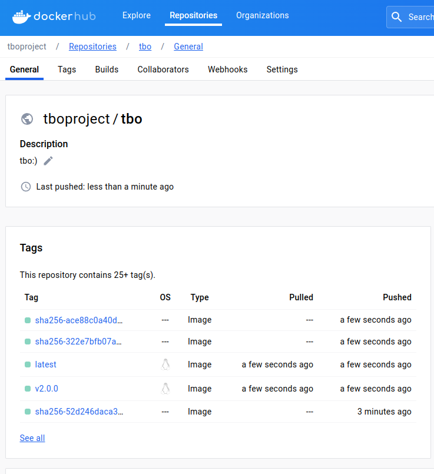

# Projekt TBO
## Skład zespołu
- Jakub Matejczyk
- Jan Rybarczyk
- Bartosz Cywiński

## Opis CICD
W CICD na początku budowany jest obraz dockerowy, który następnie wypychany jest do rejestru obrazów dockerowych `docker.io`. W zależności od tego czy jest to feature branch, czy master, obraz ma inne tagi.

Workflow następnie niezależnie od siebie uruchamia 3 gałęzie, które uruchamiają:
1. Unit testy
2. Testy SAST
3. Testy DAST
4. Testy SCA

Workflow na feature branchu uruchamia się przy pushu.
Testy sprawdzające podatności nie przechodzą, ze względu na podatności w kodzie aplikacji którą wykorzystaliśmy w projekcie. OWASP natomiast przechodzi, generując raport i issue na GitHubie.

## Dodane podatności

Na branchu `feature/vulnerabilities` do kodu dodane zostały podatności, które możliwe są do wykorzystania przez API.
### 1. SQL Injection
W pliku `project/customers/views.py` zaimplementowana została metoda `get_customer_data` przyjmująca od użytkownika ID, a następnie wykonująca zapytanie `SELECT` do bazy danych nie weryfikująca danych wejściowych w żaden sposób. Metoda podatna jest na SQL Injection.

Wykonanie metody i wykorzystanie podatności możliwe jest poprzez endpoint `/customers/${customerId}/get-data`.

### 2. Path traversal
W pliku `project/loans/views.py` zaimplementowana została metoda `get_file` przyjmująca w argumencie nazwę pliku. W tym przypadku również dane wejściowe nie są weryfikowane, przez co użytkownik może wyświetlić zawartość dowolnego pliku. Wykonanie metody możliwe jest przez endpoint `/books/get_file`.

W wyniku dodanych podatności workflow CICD nie powodzi się.
